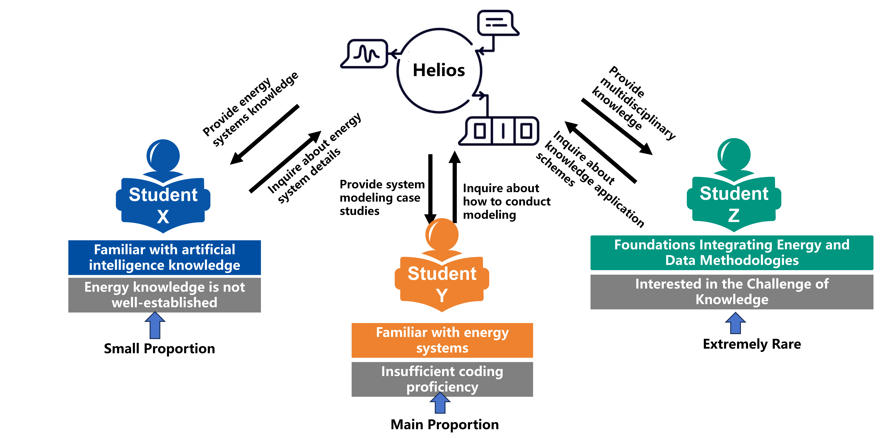
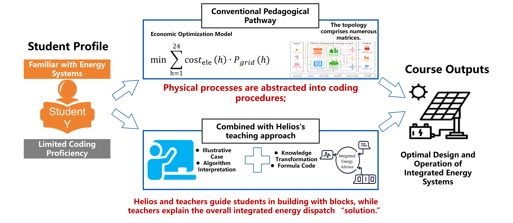

# Helios: A Foundational Language Model for Smart Energy Knowledge Reasoning and Application
 In the global drive toward carbon neutrality, deeply coordinated smart energy systems underpin industrial transformation, yet their interdisciplinary, fragmented, and fast-evolving expertise prevents general-purpose LLMs, lacking domain knowledge and physical-constraint awareness, from delivering precise engineering-aligned inference and generation.

To address these challenges, we introduce **Helios**, the first large language model tailored to the smart energy domain, together with a comprehensive suite of resources to advance LLM research in this field. Specifically, we develop **EnerSys**, a multi-agent collaborative framework for end-to-end dataset construction, through which we produce:

1. The first smart energy knowledge base, **EnerBase**, to enrich the model’s foundational expertise;
2. The first instruction tuning dataset, **EnerInstruct**, to strengthen performance on domain-specific downstream tasks; and
3. The first Reinforcement Learning from Human Feedback (RLHF) dataset, **EnerReinforce**, to align the model with human preferences and industry standards.

Leveraging these resources, Helios undergoes large-scale pretraining, instruction tuning, and RLHF. We also release **EnerBench**, the first benchmark for evaluating LLMs in smart energy scenarios, and demonstrate that our approach significantly enhances domain knowledge mastery, task execution accuracy, and alignment with human preferences.
## Note
Owing to GitHub’s repository-size constraints, we provide here only a representative subset of the training data together with all accompanying scripts (training, inference, and agent orchestration). The complete training corpus and full model checkpoints will be uploaded to an anonymous Hugging Face repository once the paper is publicly released.
## Data Collection and Curation

## Table of Contents
- **Agent**  
  Containing the Parsing Agent、Distiller Agent、Expert Agent、Check Agent ([Check Agent User Guide](Agent/Check_Agent/Guide for Check_Agent.md)) proposed in this study.
- **Data**  
  Includes EnerBase for the pre-training stage, EnerInstruct for the instruction tuning stage, and EnerReinforce for the RLHF stage.
- **EnerBench**  
  Comprises 976 subjective questions (Single-Choice, Multiple-Choice, and Fact Verification) and 625 objective questions (Question and Answers, Word explanation, and Energy System Modeling)

- **Evaluation**  
  Evaluation code including A-Score and H-Grade. (We have also prepared guidelines for using the evaluation code--[Guide for Evaluation](Evaluation/Guide for Evaluation.md))

- **Weight**

  Model weights of Helios.

- **Tools**  
  Model training and inference scripts.

## Case
### Modeling  

We attempt to address a practical modelling and optimisation task in the smart-energy domain using **Helios**. Our requirement in this example is: *How to apply rainwater energy recovery in urban sunken interchange drainage pump stations?*—and to provide the corresponding implementation code.

It can be observed that **Helios** effectively invokes domain-specific packages for intelligent energy (e.g., `oemof` and `message_ix`) to accomplish the modelling task, whereas **LLama3-8B** can only call `numpy` to perform purely numerical computations, which deviates substantially from the task requirements and lacks practical relevance to the energy sector.
### Education

We further investigate the application value and capability boundaries of **Helios** in educational settings within the smart-energy domain. Four major challenges are identified in current smart-energy professional education:

1. **Fragmented Disciplinary Knowledge and Complementary Competencies**  
   While most students possess a strong foundation in specific areas (e.g., energy systems or artificial intelligence), their interdisciplinary capabilities (e.g., integrating energy systems with AI or data-driven methods) are often insufficient. This limits their ability to undertake comprehensive modeling and multidisciplinary innovation tasks.

2. **Prominent Shortcomings in Mainstream Student Competencies**  
   The majority of students have a solid grounding in energy fundamentals but lack proficiency in programming and data modeling. This deficiency hinders their ability to learn and apply modern methodologies for intelligent energy systems.

3. **Acute Scarcity of Interdisciplinary Talent**  
   There is a severe shortage of professionals capable of effectively integrating energy systems, data science, and AI methodologies, which impedes large-scale multidisciplinary innovation practices.

4. **Challenges in Converting Diverse Matrix Types and Physical Processes into Executable Forms**  
   Energy systems involve complex mathematical matrices and physical processes. Students often struggle to translate abstract physical mechanisms or mathematical models into executable code for simulation, modeling, and engineering applications. This gap between theory and practice significantly restricts students’ deep understanding of complex systems and their ability to develop innovative solutions.

**Helios**, leveraging generative artificial intelligence (GAI), addresses these challenges by establishing a comprehensive educational workflow. This workflow encompasses automated generation of demonstration cases, step-by-step algorithm explanations, and the provision of formula and code examples. It not only structures and visualizes the principles of complex multi-energy systems—lowering the barrier to understanding abstract models—but also supports instructors in constructing tiered knowledge frameworks in the classroom. Students can start with localized physical processes and progressively master stages such as data import, model construction, and optimization, ultimately grasping the internal logic of integrated scheduling “solutions.” Additionally, Helios integrates real-time personalized prompts and Q&A tailored to individual learning progress and differences, significantly enhancing teaching efficiency and learning experiences. Through visualization demonstrations, it fosters students’ ability to apply digital tools to solve real-world energy-engineering problems.

## Why named Helios ?
Originating from the ancient Greek sun‑god, signifies the illumination of the pathway toward sustainable development through the radiance of smart energy, thereby advancing the harmonious co‑existence of humanity and the natural environment！

